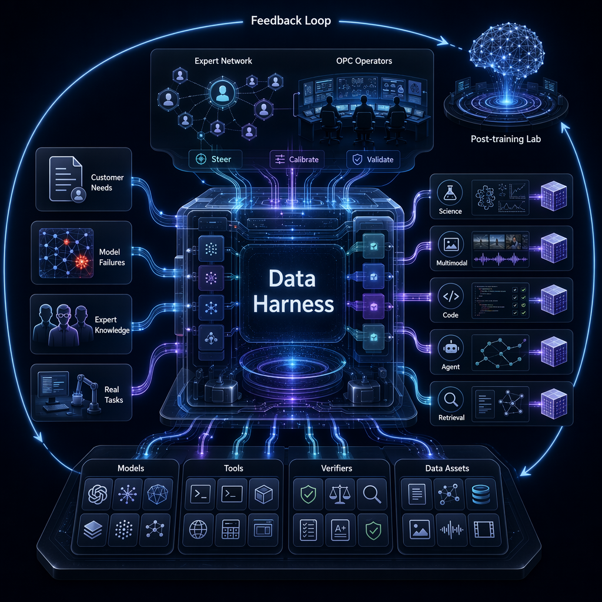

# Entropyorder

**Post-training data infrastructure for frontier model labs.**

Entropyorder (熵基秩序) supplies high-quality RL / SFT / Eval data to base-model post-training labs. We exist to solve the bottleneck that defines the capability race: expert-grade training signal is scarce, expensive to produce, and too slow to keep pace with rapid base-model iteration.

## The shift

For years, post-training data meant PhD-level experts annotating by hand — high cost, capped throughput, slow turnaround. That model has hit its ceiling. Frontier models, multi-agent frameworks, tool calling, code-execution environments, VLMs, multimodal tooling, and automatic verifiers are now mature enough to automate expert-grade data production. We turn that opportunity into infrastructure.

## Light Infra, Heavy Harness

We don't build a bloated unified platform. Base-model data needs are highly variable, formats are fragmented, and model weaknesses migrate every training round — a fixed platform cannot absorb this market.

What we build instead is a **data-production Harness**: a layer that assembles models, tools, knowledge sources, expert roles, verification rules, and delivery formats on demand, then runs task understanding, sample generation, quality verification, batch delivery, and feedback iteration at speed.

## Expert-in-the-loop

Expert knowledge — distilled into Agent Orchestrators — acts as task designer, domain-knowledge provider, quality calibrator, and boundary judge. The Harness handles candidate generation, scaling, formatting, tool verification, trajectory logging, and first-pass QC. Expert credibility is preserved; the human-throughput, cost, and latency bottlenecks of traditional annotation are broken. A single OPC super-individual now covers the full pipeline that used to require a cross-functional team.

## Architecture



## Four production Harnesses

| Harness | Covers |
| --- | --- |
| **Multi-agent synthesis** | Science reasoning, math, AI for Science, complex QA, PhD-level eval — HLE, SFE, MicroVQA, MSEarth, SciCode |
| **Long-document extraction & matching** | Textbooks, PDFs, scans, long knowledge assets → structured QA, knowledge points, image problems, solutions, training samples |
| **Agent synthesis, eval & toolchain** | Tool-use trajectories & long-horizon tasks — OpenClaw, AgentOS, SkillBench — for Agent SFT / RL |
| **Cross-modal alignment** | Video / audio / image / text understanding & alignment — streaming video response, fine-grained AV alignment, camera-movement data |

## Data product matrix

Five product lines, mapped to real customer demand and shipped commercially — not demos:

- **Science reasoning** — HLE, SFE, hard math, STEM video reasoning, cross-lingual STEM, Sci Infograph, MicroVQA, MSEarth
- **Multimodal** — streaming video active response, fine-grained AV alignment, camera-movement data, cross-lingual multimodal eval, mirror/contour perception, InfoGraph, art appreciation
- **Code** — Yukicoder extension, SciCode, OJ contest extension
- **Agent & information retrieval** — OpenClaw trajectories, AgentOS Trajectory, SkillBench, long-chain retrieval, open-ended real-world retrieval challenges

## The signal that matters

The valuable part of post-training data isn't random volume — it's high-density, verifiable, correctable training signal aimed at a model's *marginal capability zone*. A sample that almost succeeds but fails at a key step is worth more than thousands of ordinary ones.

Our loop isn't "collect → label → QA → deliver." It's:

```
Seed Mining → Task Design → Candidate Generation → Tool/Model Verification
→ Expert Calibration → Dataset Packaging → Customer Feedback → Boundary Mining
```

Every eval round, every post-training failure mode becomes input for the next data cycle. The faster it spins, the deeper our grasp of model capability boundaries — and the closer our data lands to real post-training demand.

## Vision

Ordinary data will only get less scarce. What stays scarce is the ability to construct tasks, environments, trajectories, verifiers, and corrective feedback. The future of AI data converges on simulation + environment + data: a sample is no longer just a record, but a task environment, tool calls, execution traces, error feedback, and reward signal.

Entropyorder uses data as the entry point — connecting expert organization, AI Harness, and customer model feedback — to keep producing the post-training fuel that drives models toward self-evolution, and ultimately AGI.

---

> Self-evolved AI for AGI.
